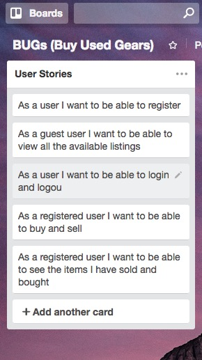
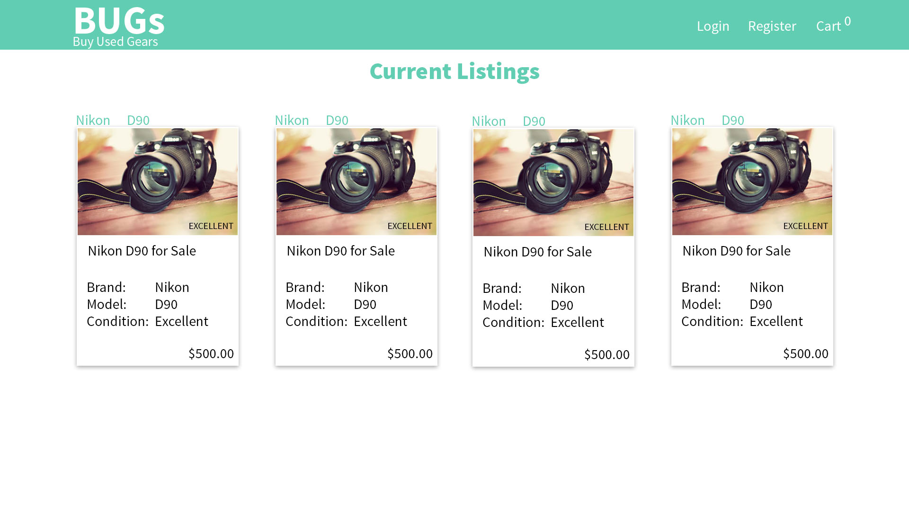
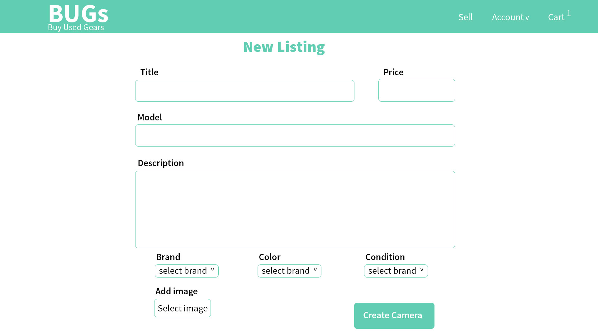
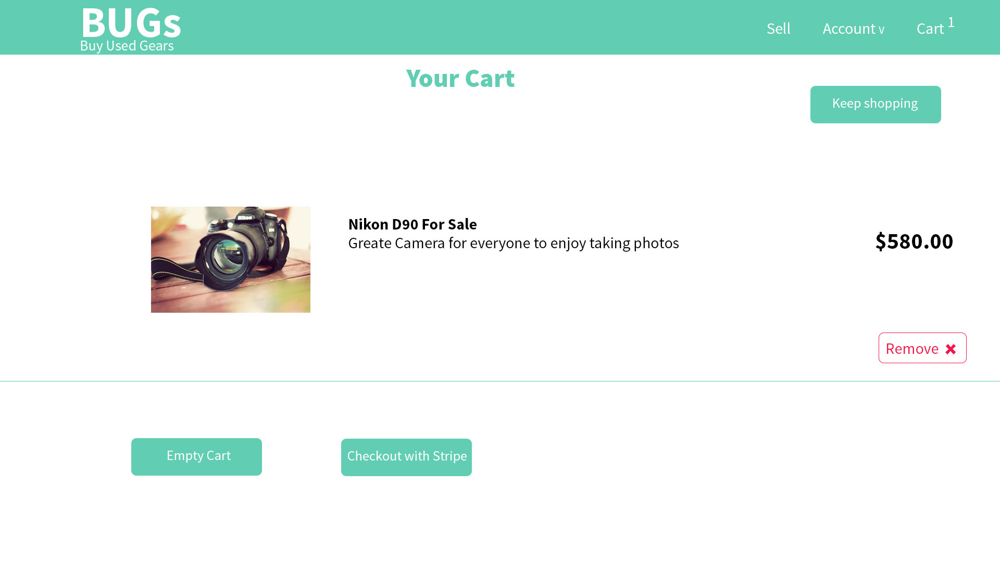
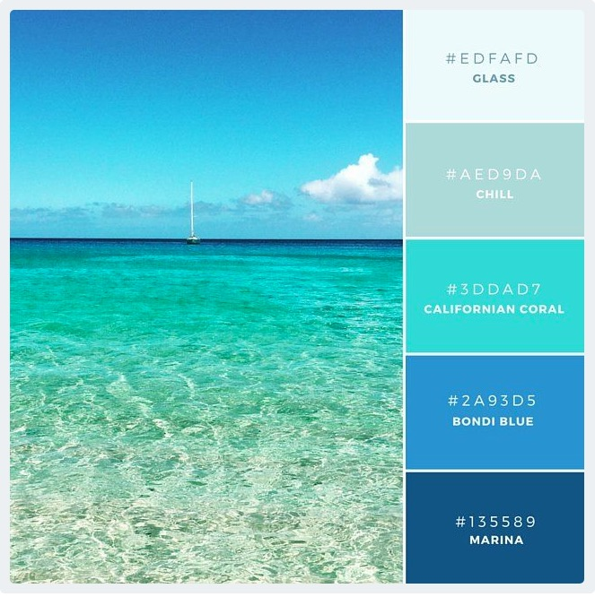

# BUGs (Buy Used Gears)

> There is no dedicated online marketplace to sell and buy used cameras. 
> BUGs solve that problem, here users can buy and sell used cameras from each others.

## Use Cases
Users sign up and browse all the avialable cameras and accessories for sale and buy what they need. 
User can also sell the camera and accessories that they don't need.
---
## User Stories
## Trello use

| User Stories    
| ------------- 
| As a guest customer I want to be able to see all the listings.  
| As a user I want to be able to register.
| As a registered user I want to be able to buy and sell items.
| As a registered user I want to be able create a listing.
| As a registered user I want to be able to see what I have sold and bought.
| As a buyer I want to be able to rate seller and vice versa
| As a registered user I want to be able to log in and logout.
| As a registered user I want to be able to change and update my profile.
| As a registered user I want to be able to add profile picture

## Detailed User Stories

As a registered user I want to be able to create listing that has:
* Title
* Description
* Model, Brand and color
* Image

---

## Wireframs and Markups
#### Index Page when no user is logged in

#### Index Page when user is logged in

#### Create a listing page

#### Cart Page

---

## Flow Charts
--- The process of the project ---

---

## Non-default Gems used

---

## Style Guide
### colors

The above colors provide modern and fresh looks. They also indicate technology and adventure which photography is part of. The colors excites the users and get the creative juices so they can imagine how will they be using the new gears they buy.
***
### Type Face
 > volkorn | represents modesty, healthy feeling.

---

## Future features
* Search fun
